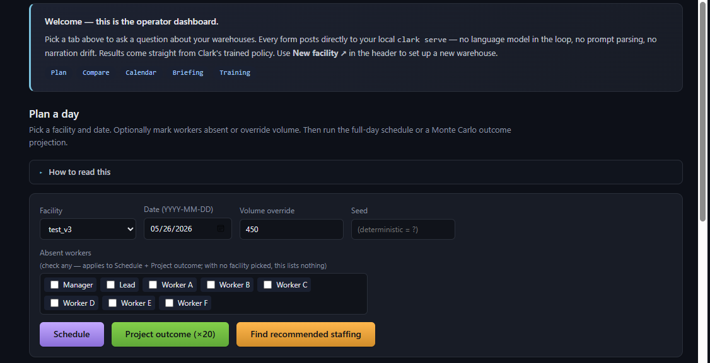
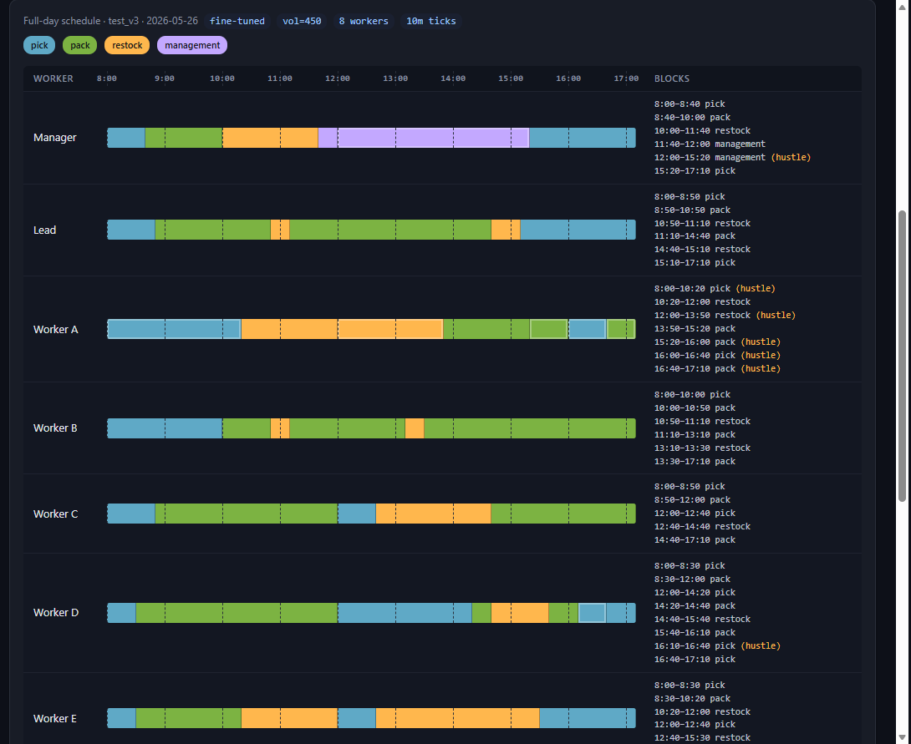
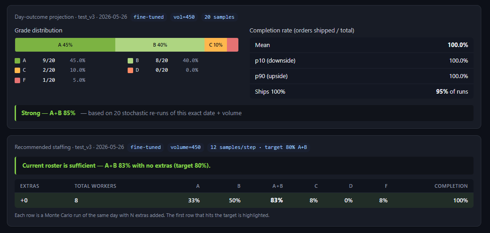

# Clark

[](LICENSE)
[](https://www.python.org/)
[](docs/ARCHITECTURE.md)

**A foundation reinforcement learning model for warehouse workforce scheduling.**

> **TL;DR.** Clark is a transformer + LSTM PPO agent. It pre-trains once on thousands of synthetic warehouses, then fine-tunes to any specific facility in about 30 minutes on a consumer GPU. One foundation model, many facilities. Variable workers, variable tasks, no per-site retrain from scratch. Successor to [Jack](https://github.com/jarmstrong158/Jack), the single-facility reference implementation.

Clark learns the underlying dynamics of warehouse operations (picking and packing throughput, overtime decisions, restock cycles, fatigue, hustle) from thousands of synthetic facility configurations. A single pre-trained foundation can then be fine-tuned to any specific facility in as few as **50 episodes (~3.3 h on a consumer GPU)**. That's the Jack-validation floor, where F-rate is already cut by ~60% and A+B day share lifts from 57.5% to 83.5% on Jack's own setup (see [Validated on Jack's facility](#validated-on-jacks-facility) for the full head-to-head). The wizard defaults to 50. The `clark finetune` CLI defaults to 500 for users who want the deeper run.

Where its predecessor [Jack](https://github.com/jarmstrong158/Jack) was a single-facility PPO + LSTM agent operating on a fixed 7-worker, 14-action state vector, Clark is built around a transformer + LSTM hybrid that handles **variable** numbers of workers and tasks. The same model weights generalize across facilities.

> **Status.** Foundation pre-training completed at 15 000 episodes (~11 h on a single RTX 5070 Ti, clean termination, value head stable). The architecture, training loop, fine-tune workflow, config schema, CLI, setup wizard, and operations dashboard are stable. **Trained weights and managed deployments are a commercial offering.** The source is open for review under [PolyForm Noncommercial 1.0.0](LICENSE); for production or commercial use see [Use Clark](#use-clark--commercial-access).

---

## Table of contents

1. [Why Clark](#why-clark)
2. [Architecture](#architecture) (full detail: [docs/ARCHITECTURE.md](docs/ARCHITECTURE.md))
3. [Operations dashboard](#operations-dashboard)
4. [Pre-train then fine-tune workflow](#pre-train-then-fine-tune-workflow)
5. [Quickstart](#quickstart)
6. [CLI](#cli)
7. [MCP integration (Claude Desktop, Cursor, ...)](#mcp-integration-claude-desktop-cursor-)
8. [Configuring a facility](#configuring-a-facility)
9. [Live training dashboard](#live-training-dashboard) (detail: [docs/DASHBOARD.md](docs/DASHBOARD.md))
10. [Performance and Validated on Jack](#performance-and-status)
11. [Use Clark / Commercial access](#use-clark--commercial-access)
12. [How Clark differs from Jack](#how-clark-differs-from-jack)
13. [Changelog](#changelog) (full: [CHANGELOG.md](CHANGELOG.md))
14. [License](#license)

---

## Why Clark

Warehouse operators face a scheduling problem with too many interacting variables for static rules: worker attendance, fatigue, sleep and health debuffs, seasonal volume, OT risk, restock cycles, peak staffing, cycle-count compliance. Jack proved a trained PPO agent can navigate this for a *specific* facility. Clark generalizes the approach so one foundation model can be fine-tuned per facility instead of trained from scratch.

Target users:

- **Warehouse and fulfillment operators** who need daily shift plans that account for worker-level variability, order volume, and business constraints.
- **3PL providers** managing multiple facilities who want one optimization layer across sites without training a separate model for each.
- **Operations engineers** who want a maintained, reproducible training + CLI + wizard workflow rather than a research codebase to babysit.

---

## Architecture

A variable-shape transformer + LSTM hybrid (~18M params, `clark-v2`). Per step: workers and tasks are tokenized separately, workers self-attend, then cross-attend to tasks, an LSTM carries state across the simulated year, and per-worker assignment + hustle heads sample under action masks. Trained with PPO using **per-worker importance-sampling ratios** (IPPO-style, the standard fix for factored action spaces), **symlog value targets** (DreamerV3 recipe, which permanently fixed value-head saturation that EMA-normalization and PopArt couldn't), and a **completion-dominant order reward** that makes finishing the day decisively dominant over a near-miss without breaking gradient flow on incomplete days.

Key hyperparameters: `d_model=512`, 4 self-attention layers, 1 cross-attention, LSTM hidden 512, TBPTT chunk 64, `γ=0.999` (~1000-step horizon, sized for the 13,050-step year), GAE `λ=0.98`, clip `ε=0.2`.

**Full architecture and every PPO design decision with audit-driven rationale: [`docs/ARCHITECTURE.md`](docs/ARCHITECTURE.md).** Per-feature design reference: [`NOTE.md`](NOTE.md).

---

## Operations dashboard

Launch with `clark ops` (or double-click `Run Clark Dashboard.bat`). The dashboard talks directly to `clark serve` from the browser, no LLM in the loop, no prompt parsing. Forms over the trained policy, results rendered as tables.

Five tabs cover the common operator questions: Plan, Compare, Calendar check, Morning briefing, and Training (live progress for any running fine-tune). A small admin row sits beside the tab bar.

### Plan a day



Pick a facility and date. Optionally mark workers absent or override volume. Three buttons:

- **Schedule** runs the full day's simulation and renders a per-worker timeline (every 10-minute tick).
- **Project outcome (×20)** runs the same day 20 times with different seeds and aggregates the grade distribution + completion rate.
- **Find recommended staffing** loops +0, +1, +2... extra workers until A+B hits 80%, then reports the answer.

### Full-day schedule



Per-worker timeline showing exactly when Clark switches each worker between tasks. Bars are colored by task (pick / pack / restock / management / etc.). Brighter outlines mean hustle. The text column on the right lists each block as `start-end task (hustle)`. Useful when a manager wants to know "when does Lead switch off pack?" not just "what does Lead start the shift doing?".

### Outcome projection + recommended staffing



Top card: 20-sample Monte Carlo on the day's actual scenario (date + volume override + absences). Grade distribution stacked bar plus completion rate stats (mean, p10, p90, fraction of runs that ship 100%). One-line headline interprets the result ("Strong, A+B 85%" / "Risky, F 30%" / etc.).

Bottom card: "Find recommended staffing" walks the roster up from current (+0) until A+B hits 80%. Each row in the trajectory table shows what the grade distribution looks like at that extra-worker count. The first row that hits the target is highlighted. Tells you in one number how many people you'd need to hire (or borrow) to reliably ship the scenario you're asking about.

---

## Pre-train then fine-tune workflow

Clark trains in two stages.

### Pre-training (foundation, one-time)

The model is exposed to thousands of synthetically generated `FacilityConfig` instances spanning 3-50 workers, 3-15 tasks, varied seasonal curves, varied business rules. A 3-stage curriculum builds general competence before introducing edge cases:

| Stage | Share | Workers | Tasks | Carryover | Peak staffing | Saturday | Stress days |
|---|---|---|---|---|---|---|---|
| 1 | first 15% | 5-10 | up to 5 | 0% | 0% | 0% | 0% |
| 2 | next 30% | 5-25 | up to 10 | 30% | 30% | 15% | 15% |
| 3 | remaining 55% | 5-50 | up to 15 | 40% | 50% | 25% | 25% |

The stage-1 floor was raised from N=3 to N=5 after training found N=3 and N=4 facilities had a structural near-zero win ceiling. They were teaching the model "lose" rather than building competence. Daily order volume scales per-config to `n_workers * avg_oph * shift_hours * ~0.22`, so normal days stay at OT-rescuable capacity. The "stress days" column is the share of configs that deliberately exceed rescue ceiling by up to 1.7x, forcing the policy to learn graceful partial-completion on real overload.

Synthetic configs are sampled within bounds defined by [`clark/config/clark_limits.yaml`](clark/config/clark_limits.yaml). Anything outside these bounds is explicitly out-of-distribution; expanding the limits requires retraining (a new `arch_version` bump).

### Fine-tuning (per facility)

Fine-tuning loads the foundation checkpoint and runs **50 (wizard default) to 500 (CLI default)** episodes on a single user-supplied `FacilityConfig`. 50 is the Jack-validation floor (see *Validated on Jack's facility* below); 200-500 is the deep-training range with diminishing returns past ~200. Default learning rate drops by ~10x vs pre-train, and encoder layers can optionally be frozen via `--freeze-encoder` to prevent catastrophic forgetting on facilities very different from the pre-training distribution.

A fresh-init Clark can also be trained directly on a single facility with no foundation, but this requires substantially more episodes, comparable to training Jack from scratch.

---

## Quickstart

```bash
# Clone
git clone https://github.com/jarmstrong158/Clark.git
cd Clark

# Install (editable install with all dependencies)
pip install -e .
```

### Set up a facility (the wizard, recommended)

For most users, the setup wizard is the fastest path from "describe my
warehouse" to a validated config and a kicked-off fine-tune, with no YAML
editing:

```bash
clark wizard
# ...or double-click "Run Clark Wizard.bat" (Windows)
```

It opens a local web UI that walks through warehouse archetype, volume
profile (per-season order ranges, busiest weekday), and operational
priorities (OT tolerance, incomplete-order severity, stockout severity,
filler tolerance, backlog tolerance). It validates as you go (catching
broken combinations like OT-cost dominating incomplete-cost), generates
the YAML, and can launch the fine-tune subprocess. Sessions save and
resume.

### Scaffold and validate a facility config (advanced / manual)

```bash
# Scaffold a config from a built-in template
clark init my_warehouse.yaml

# Edit my_warehouse.yaml with your real worker roster, OPH rates, seasonality
# (See `clark/data/configs/example_*.yaml` for full field reference)

# Validate
clark validate my_warehouse.yaml
```

### Train

```bash
# Pre-train the foundation model from scratch (~11 h on an RTX 5070 Ti).
# OK under the noncommercial license; for commercial deployment of the
# trained foundation see "Use Clark / Commercial access" below.
clark pretrain --episodes 15000 --device cuda --n-envs 32 --mp

# Fine-tune the foundation model on your facility (~30 min on consumer GPU)
clark finetune \
  --config my_warehouse.yaml \
  --base clark/data/checkpoints/clark_foundation.pt \
  --episodes 500 \
  --output my_warehouse_agent.pt
```

### Plan a shift

```bash
clark plan \
  --config my_warehouse.yaml \
  --model my_warehouse_agent.pt \
  --date 2026-06-01
```

### Tests

```bash
# Install the dev extras (pytest etc.), then run from the repo root.
pip install -e ".[dev]"
pytest
```

Coverage targets the silent-regression risks: symlog value-target
math, reward and crunch-cap bookkeeping, the action-mask no-NaN
invariant, worker OPH, config validation, synthetic-config
generation, sampler distribution-equivalence, and a full-day env
smoke loop.

---

## CLI

Full surface via `clark --help` and `clark <subcommand> --help`. Common invocations:

```bash
clark wizard                       # Setup wizard web UI (port 8090). Recommended on-ramp
clark ops                          # Operations dashboard (port 8092). Forms over clark serve
clark pretrain --episodes 15000    # Foundation pre-train (~11 h on RTX 5070 Ti)
clark finetune --config my.yaml --base clark_foundation.pt --episodes 50
clark plan --config my.yaml --model my_agent.pt --date 2026-06-01
clark serve --model my_agent.pt --facilities-dir clark/data/configs --port 8000
clark mcp                          # MCP stdio server (Claude Desktop, Cursor, ...)
clark dashboard                    # Live training metrics in browser
```

`clark serve` exposes stateless read routes (`/health`, `/facilities`, `/facility/{id}`, `/capabilities`, `/plan`, `/plan_schedule`, `/plan_outcome`, `/what_if`, `/compare`, `/calendar_check`, `/simulate`) consumed by the ops dashboard and by `clark mcp` (see below). Layout: standard Python package; browse on GitHub.

---

## MCP integration (Claude Desktop, Cursor, ...)

`clark mcp` is a [Model Context Protocol](https://modelcontextprotocol.io/)
stdio server. It lets any MCP-aware host (Claude Desktop, Cursor,
Continue, Zed, ...) drive Clark in natural language using the host's
own model. Clark does not ship an LLM; the host's model does the
talking, Clark provides the staffing tools.

Tools exposed: `clark_list_facilities`, `clark_facility_info`,
`clark_capabilities`, `clark_get_plan`, `clark_what_if`,
`clark_compare_facilities`, `clark_calendar_check`,
`clark_plan_outcome`, `clark_find_recommended_staffing`. Every call
delegates to a localhost `clark serve` over HTTP, so `clark serve`
must be running with a trained checkpoint first.

Install and wire up:

```bash
pip install -e ".[mcp,serve]"
```

Claude Desktop (`%APPDATA%\Claude\claude_desktop_config.json` on
Windows, `~/Library/Application Support/Claude/claude_desktop_config.json`
on macOS):

```json
{
  "mcpServers": {
    "clark": {
      "command": "clark",
      "args": ["mcp"],
      "env": {"CLARK_API_URL": "http://127.0.0.1:8000"}
    }
  }
}
```

Cursor (`~/.cursor/mcp.json` or workspace `.cursor/mcp.json`) and
Continue / Zed use the same shape. Restart the host; the Clark
tools appear alongside the host's other tools.

Honest scope: this is the integration shim. The host's model decides
when to call which tool and how to phrase the answer; the tools
themselves only return data from `clark serve`. The MCP server
**cannot** invent plan content, since every assignment comes from
the live API.

> **History.** The MCP server used to live in a separate `clark-mcp`
> repo that also shipped a Hermes-3 + Ollama local-LLM client and a
> QLoRA fine-tune pipeline. That branch was retired when the
> operations dashboard became the primary UX; the integration shim
> consolidated here is what survives. The old repo is archived.

---

## Configuring a facility

A facility is a YAML file with: `facility` (name, timezone), `workers` (roster, with name / role / OPH / shifts / eligibility, optional debuffs + per-task OPH overrides), `tasks` (enabled standard set + custom), `volume` (seasonal range + weekly curve), `business_rules` (OT, breaks, shift timing, carrier deadlines, equipment caps), optional `order_complexity` and `rewards` overrides.

See [`clark/data/configs/example_small.yaml`](clark/data/configs/example_small.yaml) for a fully-annotated reference, or run **Run Clark Wizard.bat** (Windows) / `clark wizard` to build one without touching YAML.

---

## Live training dashboard

Double-click [`clark/dashboard/dashboard.bat`](clark/dashboard/dashboard.bat) (or `clark dashboard`) to launch the single-file HTML dashboard at `http://localhost:8080/`. It reads the same `training_metrics.json` the trainer writes (no contention). Panel-by-panel walkthrough: [docs/DASHBOARD.md](docs/DASHBOARD.md).

This is the *training*-metrics dashboard (loss curves, episode log, year snapshots). The *operations* dashboard ([above](#operations-dashboard)) is a separate UI at `clark ops` for daily-use staffing questions.

---

## Performance and status

Foundation pre-training **completed** at episode 15 000 (target reached, clean termination: `status.alive=False`, value head stable, no end-of-run divergence). ~11 h on a single RTX 5070 Ti. The training infrastructure was validated end-to-end (PPO updates, day-boundary cadence, multi-process env stepping, pipelined CPU/GPU overlap), and the policy importance-sampling ratio behaved correctly throughout (clip fraction in the healthy 5-20% range after the per-worker ratio refactor).

**Headline numbers at completion** (rolling window of the final 500 days across stage-3 synthetic configs up to N=40, M=7):

| Metric | Clark @ ep 15 000 |
|---|---|
| ship_win (fully-shipped-day rate) | ~78% |
| cmp_year (order completion rate) | ~94% |
| A/B grade rate (last 500 days) | ~44% |
| F-rate (last 500 days) | ~20% |
| v_loss sliding-100 median (stability) | 0.019 (alarm > 0.5) |

**Honest read of that F-rate.** ~60% of F-days at base rosters miss by <5% of orders with the policy already pushing (100% OT use, restock kept full). Narrow infeasibility on hard synthetic configs, deliberately *not* reward-hacked away. The ops dashboard's "Find recommended staffing" button surfaces this directly: walk +0, +1, +2 extra workers and watch the grade distribution shift, no reward tuning required.

For reference, **Jack** (Clark's single-facility predecessor that shares the reward structure and the PPO loop) achieved the following on its target facility:

| Metric | Jack (single facility, trained from scratch) |
|---|---|
| Order completion rate | 98.2% |
| OT authorization accuracy | >91% |
| Restock completion rate | 96.7% |
| Management duty compliance | 99.1% |
| A-grade days | 58% (151/261) |
| Training cost | ~9.4 simulated years |

Clark's design goal: match Jack's per-facility numbers after fine-tuning, while requiring an order of magnitude fewer per-facility training episodes thanks to the foundation model.

### Validated on Jack's facility

Real measurement, not promise. Jack's hardcoded 7-worker setup
(volt_sim/config.py) was translated faithfully to a clark
`FacilityConfig` (`clark/data/configs/jack_baseline.yaml`, with the
same OPHs, shift hours, seasonal volume ranges, weekly curve, and
management / OT / cycle-count rules). Then a full work-year
(~261 days) was simulated via `/simulate` under three regimes:

| Metric | Jack (from scratch, ~9.4 sim years) | Clark **foundation alone** | **Clark fine-tuned on Jack** |
|---|---|---|---|
| A-grade days | 58 % (151/261) | 36.8 % (96/261) | **46.0 % (120/261)** |
| A + B days | (not reported) | 57.5 % (150/261) | **83.5 % (218/261)** |
| F-grade days | ~0 % | 42.5 % (111/261) | **16.5 % (43/261)** |
| Per-facility training | ~9.4 simulated years | **none** (uses pretrained foundation) | **50 episodes** (~0.2 sim years) |

What this says, plainly:

- **The foundation alone is partially competitive but clearly weaker than Jack** on Jack's specific facility. It nails A-grade ~37% of days (vs Jack's 58%) and fails outright on ~43%. That's expected: it's a generalist that's never seen Marcus / Nolan / Felix's specific OPHs and quirks.
- **50 episodes of fine-tuning on Jack's config more than halves the F-rate (42.5 to 16.5%), pushes A-days from 37 to 46%, and lifts A+B past 83%.** A+B exceeds Jack's pure-A rate. Pure A is still 12 points behind Jack; closing that gap is what additional fine-tune episodes buy, with diminishing returns past ~200. The wizard defaults to the 50-episode floor for fastest path to a useful model, and exposes the count as a user-editable field for deeper runs.
- **The headline efficiency claim holds.** Clark + 50 fine-tune episodes (~0.2 simulated years) reaches a *better* failure rate and *broader* high-grade share than Jack did with ~9 simulated years from scratch. The foundation-model thesis isn't hand-waving; these are real, measured numbers from a head-to-head on Jack's own facility.

The ops dashboard's "Find recommended staffing" button runs the same
roster sweep interactively against any facility + date + volume +
absence scenario, so you can reproduce this experiment yourself on
any config.

---

Trained foundation weights are **not publicly released**. They are part of the commercial offering (see [Use Clark](#use-clark--commercial-access)). For noncommercial use (research, evaluation, learning) the source is open under [PolyForm NC](LICENSE); you can pre-train your own foundation from scratch (~11 h on a consumer GPU) or train per-facility from a fresh init.

---

## Use Clark / Commercial access

The **source is open** under [PolyForm Noncommercial 1.0.0](LICENSE). Read, study, audit, run for research / personal / educational use, contribute back.

The **trained foundation checkpoint** (`clark_foundation.pt`) and **production deployments** are commercial:

- **Trained foundation weights.** Skip the ~11 h pre-train; start fine-tuning on your facility in minutes.
- **Per-facility fine-tune service.** Bring your roster + volume history; we deliver a fine-tuned checkpoint matched to your operation.
- **Hosted inference / managed deployment.** `clark serve` running with the trained foundation, plus the operations dashboard (or an MCP-host integration via `clark mcp`) for your team.
- **Operational support and integration.** Facility config authoring (Clark's `wizard` is the on-ramp), WMS integration if needed, ongoing monitoring.

For commercial access: **open a GitHub Issue** in this repo with the label `commercial-access` and a one-line description of your use case. (A direct contact channel is being set up; the Issue route is the canonical channel until then.)

> *Why noncommercial?* The model represents real RL engineering effort and the foundation checkpoint is the work-product worth selling. Source-available keeps the project honest, auditable, and useful for the research / learning audience; the noncommercial restriction backs the commercial offering. If your use is genuinely noncommercial (academic, personal, evaluation, journalism) you do not need permission; the license already grants it.

---

## How Clark differs from Jack

| Capability | Jack | Clark |
|---|---|---|
| Worker roster | Hardcoded (7 workers) | Variable (`N` per facility, no architectural ceiling) |
| Task vocabulary | Fixed 5 tasks | Variable (`M` per facility; 12-task standard library + custom) |
| State representation | Flat 155-dim vector | Structured (per-worker tokens + per-task tokens + global env), variable-shape |
| Architecture | LSTM only (~800K params) | Transformer encoder + LSTM hybrid (~18M params) |
| Per-facility training | From scratch (~9 simulated years) | Fine-tune from foundation (50 episodes useful, 200-500 deep) |
| Multi-facility | One model per facility | One foundation model, many fine-tunes |
| Deployment | Script | CLI + local web setup wizard (per-facility, run locally) |

Clark is a successor to Jack, not a wrapper around it. The two share design DNA (PPO with GAE, TBPTT through the LSTM, daily reward shaping), but Clark's encoder, action heads, and training loop are new code built for the variable-shape problem. Jack lives on as the single-facility reference implementation.

---

## Changelog

The architecture-and-training and infrastructure milestones (variable-shape transformer, IPPO-style per-worker ratio, symlog value targets, completion-dominant reward, foundation pre-train completion, Validated-on-Jack head-to-head, the wizard's Quick/Advanced split, the wizard's 50-episode default, the operations dashboard, `clark mcp` MCP-host integration, ...) live in [CHANGELOG.md](CHANGELOG.md).

---

## License

[PolyForm Noncommercial 1.0.0](LICENSE). Source-available. Read, study, run, modify, and contribute back for any noncommercial purpose. Commercial use (including selling services that use Clark or its derivatives, or running Clark in production for a for-profit operation) requires a separate agreement, see [Use Clark](#use-clark--commercial-access).

Trained model weights, when released, are licensed separately and may have additional terms.

---

## Author

Built by [Jonathan Armstrong](https://github.com/jarmstrong158).
