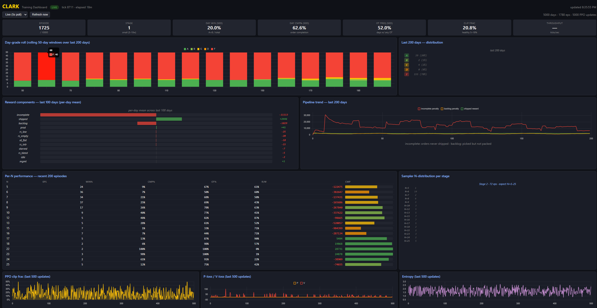
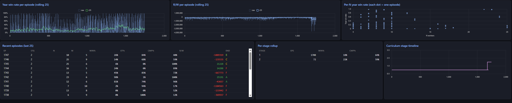

# Clark

[](LICENSE)
[](https://www.python.org/)
[](docs/ARCHITECTURE.md)

**A foundation reinforcement learning model for warehouse workforce scheduling.**

> **TL;DR** — Clark is a transformer + LSTM PPO agent that pre-trains on thousands of synthetic warehouses, then fine-tunes to any specific facility in ~30 minutes on a consumer GPU. One foundation model, many facilities — variable workers, variable tasks, no per-site retrain from scratch. Successor to [Jack](https://github.com/jarmstrong158/Jack), the single-facility reference implementation.

Clark learns the underlying dynamics of warehouse operations — picking and packing throughput, overtime decisions, restock cycles, fatigue and hustle interactions — from thousands of synthetic facility configurations. A single pre-trained foundation model can then be fine-tuned to any specific facility in 200–500 episodes (~30 min on a consumer GPU) instead of being trained from scratch.

Where its predecessor [Jack](https://github.com/jarmstrong158/Jack) was a single-facility PPO + LSTM agent operating on a fixed 7-worker, 14-action state vector, Clark is built around a transformer + LSTM hybrid that handles **variable** numbers of workers and tasks. The same model weights generalize across facilities.

> **Status:** Foundation pre-training is actively in progress. The architecture, training loop, fine-tune workflow, configuration schema, and REST API are stable. Code is open; pre-trained foundation weights will ship in a future release.

---

## Table of contents

1. [Why Clark](#why-clark)
2. [Architecture](#architecture)
3. [Pre-train → fine-tune workflow](#pre-train--fine-tune-workflow)
4. [Quickstart](#quickstart)
5. [CLI reference](#cli-reference)
6. [REST API](#rest-api)
7. [Project structure](#project-structure)
8. [Configuring a facility](#configuring-a-facility)
9. [Performance and status](#performance-and-status)
10. [How Clark differs from Jack](#how-clark-differs-from-jack)
11. [Roadmap](#roadmap)
12. [License](#license)

---

## Why Clark

Warehouse operators face a scheduling problem with too many interacting variables for static rules: worker attendance, fatigue, sleep and health debuffs, seasonal volume, OT risk, restock cycles, peak-staffing, cycle-count compliance. Jack proved a trained PPO agent can navigate this for a *specific* facility. Clark generalizes the approach so one foundation model can be fine-tuned per facility instead of trained from scratch.

Target users:

- **Warehouse and fulfillment operators** who need daily shift plans that account for worker-level variability, order volume, and business constraints
- **3PL providers** managing multiple facilities who want one optimization layer across sites without training a separate model for each
- **Operations engineers** who want a production-ready training and inference API rather than a research codebase to maintain

---

## Architecture

```
Per-step inputs (variable shapes — N workers, M tasks)
  worker_feats : (N, 14)   per-worker state (OPH, hours, fatigue, debuffs, ...)
  task_feats   : (M, 3)    demand signal + task type per task
  env_feats    : (17,)     time, orders, restock, season, OT, complexity, ...

Encoder
  W = WorkerLinear(worker_feats) + RoleEmbed(roles)        → (N, 512)
  T = TaskLinear(task_feats)     + TaskTypeEmbed(types)    → (M, 512)
  E = EnvLinear(env_feats)                                 → (512,)
  W = W + E.unsqueeze(0)
  W = SelfAttention(W) × 4               # workers attend to each other
  W = CrossAttention(W, T) + FF          # workers attend to tasks

Temporal memory
  g = mean(W)
  h, lstm_state = LSTM(g, lstm_state)    # carries across the simulated year
  W_final = W + LSTMProj(h).unsqueeze(0)

Outputs
  assignment_logits = W_final @ T.T      # (N, M)  masked + sampled per worker
  hustle_logits     = HustleHead(W_final)# (N, 2)  masked + sampled per worker
  value             = ValueHead(h)       # ()
```

| Hyperparameter | Value |
|---|---|
| `d_model` | 512 |
| Self-attention layers | 4 |
| Cross-attention layers | 1 |
| Attention heads | 8 |
| LSTM hidden size | 512 |
| TBPTT chunk size | 64 |
| Discount factor `γ` | 0.999 |
| GAE `λ` | 0.98 |
| Clip `ε` | 0.2 |
| Approx parameters | ~18M |
| Architecture version | `clark-v2` |

`γ=0.999` gives an effective horizon of ~1000 steps (≈ 2 simulated days), sized for the 13,050-step year. The default `γ=0.99` would have decayed end-of-day rewards to ~0.6 by 9 AM choices and made multi-week consequences (cycle count compliance, management backlog) effectively invisible to gradient descent. Tuned per the standard recommendation for long-horizon RL with sparse terminal rewards.

Key design points:

- **Variable-shape architecture.** Workers and tasks are token sequences; the model has no hardcoded dependence on N or M.
- **Action masks for both heads.** Task-assignment masks (eligibility, OT-pick-pack-plus-restock-when-stock-critical, management quota gating, restock-only-when-needed, pick-buffer-cap, idle-only-when-absent-or-shift-exhausted) and hustle masks (per-worker absent / cap-exhausted) are applied as `-1e9` fills before softmax in both rollout AND PPO update. Invalid actions never receive gradient, and the importance-sampling math stays consistent across rollout and update.
- **Per-worker PPO ratio.** The policy importance-sampling ratio is computed and clipped *per-worker per-head* rather than as a sum across all 2N decisions. Without this, ratio variance scales linearly with N (a 25-worker config produces ratio stdev ~0.35 from harmless replay drift, which alone saturates `clip_eps=0.2`). This is the standard fix for factored / multi-agent action spaces (IPPO).
- **Assignment logits scaled by `1/√d_model`.** The `W_final @ T.T` matmul is divided by `√d_model` (~22 at d_model=512) so logits at init are O(1) and softmax is well-tempered. Without this scaling the matmul outputs O(20) magnitudes, causing immediate near-argmax collapse and entropy crash. Same trick scaled-dot-product attention uses for its scores.
- **EMA running return normalization for the value loss.** The value head trains against returns normalized by a global EMA of `mean`/`var` (not per-batch stats). Per-batch standardization on a 64-step TBPTT chunk produced tiny / unstable σ — value loss exploded and the head chased moving targets across chunks. Replaced an earlier PopArt experiment that didn't fit the per-day single-trajectory update setting.
- **Per-worker mean entropy.** The entropy bonus is averaged over workers, not summed. Sum-over-workers made the bonus magnitude scale with N, swamping the policy gradient at large facilities and collapsing exploration at small ones. `entropy_coeff=0.10` keeps healthy exploration without dominating the policy gradient.
- **TBPTT** with `chunk_size = 64` truncates LSTM gradients across the full simulated year (~13,050 steps). 64 covers ~half a day's gradient horizon and keeps per-batch correlation low enough that the value-loss running stats stay stable. Chunks are split at any worker-count change (peak-staffing arrivals) so the per-step state stack stays homogeneous.
- **Bounded incomplete-penalty + completion bonus.** The `per_order_incomplete = -10 × N_unshipped` multiplier is now capped at `min(N_unshipped, 50)` so the per-event floor is -500, symmetric with a new `+500 × cmp_year` shaping bonus applied at year end. Earlier runs with the unbounded penalty produced day-rewards down to -130k and year returns to -3.26M — a fat-tail distribution that the value head fit by learning huge canceling biases (output std ~3,000, weight matrix saturated). After capping, returns become well-behaved and `v_loss` collapses from a bimodal s/m=228× to s/m≈1×. Reward / return clips remain ±20k per step and ±500k on GAE returns as a defense-in-depth ceiling.
- **Physical pick-buffer cap.** `pick_buffer_capacity` is an env-level cart-space proxy (6-12 × N workers in synthetic configs) that removes "pick" from the action mask when `orders_picked_not_audited` reaches the cap. Real warehouses can only stage so many picked orders before the buffer is physically full and pickers have to wait. Without this cap the env let pickers (which are 2.5× faster than packers in this sim) pile up unbounded backlog that packers couldn't clear, producing the picked_backlog reward dominance an audit identified. Pick/pack balance now emerges from the env constraint instead of being something the model has to learn from a delayed end-of-day signal.
- **Dropout disabled** in the policy network. The cross-rollout/update dropout-mask difference would create importance-ratio noise on the order of `clip_epsilon` even with frozen weights — saturating the clip threshold structurally.
- **fp32 log-prob storage.** Old log-probs are cast to fp32 before storing (rollout runs under bf16 autocast). bf16 quantization noise on a sum-over-workers log-prob is comparable to `clip_eps` itself.
- **bf16 AMP** on CUDA with explicit fp16 fallback for hardware without bf16 support.

Full architectural detail in [`docs/ARCHITECTURE.md`](docs/ARCHITECTURE.md). Full per-feature reference in [`NOTE.md`](NOTE.md).

---

## Pre-train → fine-tune workflow

Clark trains in two stages.

### Pre-training (foundation, one-time)

The model is exposed to thousands of synthetically generated `FacilityConfig` instances spanning 3–50 workers, 3–15 tasks, varied seasonal curves, varied business rules. A 3-stage curriculum builds general competence before introducing edge cases:

| Stage | Share | Workers | Tasks | Carryover | Peak staffing | Saturday |
|---|---|---|---|---|---|---|
| 1 | first 15% | 5–10 | up to 5 | 0% | 0% | 0% |
| 2 | next 30% | 5–25 | up to 10 | 30% | 30% | 15% |
| 3 | remaining 55% | 5–50 | up to 15 | 40% | 50% | 25% |

The stage-1 floor was raised from N=3 to N=5 after training found N=3 and N=4 facilities had a structural near-zero win ceiling — they were teaching the model "lose" rather than building competence. Daily order volume scales per-config to `n_workers × avg_oph × shift_hours × ~0.4` so even peak summer days stay at ≤110% of physical capacity (no impossible-by-construction configs).

Synthetic configs are sampled within bounds defined by [`clark/config/clark_limits.yaml`](clark/config/clark_limits.yaml). Anything outside these bounds is explicitly out-of-distribution; expanding the limits requires retraining (a new `arch_version` bump).

### Fine-tuning (per facility, per facility)

Fine-tuning loads the foundation checkpoint and runs 200–500 episodes on a single user-supplied `FacilityConfig`. Default learning rate drops by ~10× vs pre-train, and encoder layers can optionally be frozen via `--freeze-encoder` to prevent catastrophic forgetting on facilities very different from the pre-training distribution.

A fresh-init Clark can also be trained directly on a single facility with no foundation, but this requires substantially more episodes — comparable to training Jack from scratch.

---

## Quickstart

```bash
# Clone
git clone https://github.com/jarmstrong158/Clark.git
cd Clark

# Install (editable install with all dependencies)
pip install -e .
```

### Set up a facility — the wizard (recommended)

For most users, the setup wizard is the fastest path from "describe my
warehouse" to a validated config and a kicked-off fine-tune, with no YAML
editing:

```bash
clark wizard
# ...or double-click "Run Clark Wizard.bat" (Windows)
```

It opens a local web UI that walks through warehouse archetype, volume
profile (per-season order ranges, busiest weekday), and operational
priorities (OT tolerance, incomplete-order severity, stockout severity,
filler tolerance, backlog tolerance). It validates as you go (catching
broken combinations like OT-cost dominating incomplete-cost), generates
the YAML, and can launch the fine-tune subprocess. Sessions save and
resume.

### Scaffold and validate a facility config (advanced / manual)

```bash
# Scaffold a config from a built-in template
clark init my_warehouse.yaml

# Edit my_warehouse.yaml with your real worker roster, OPH rates, seasonality
# (See `clark/data/configs/example_*.yaml` for full field reference)

# Validate
clark validate my_warehouse.yaml
```

### Train

```bash
# Pre-train the foundation model (multi-day GPU job — only run if you want
# to retrain from scratch; otherwise wait for the released checkpoint).
clark pretrain --episodes 10000 --device cuda --n-envs 32 --mp

# Fine-tune the foundation model on your facility (~30 min on consumer GPU)
clark finetune \
  --config my_warehouse.yaml \
  --base clark/data/checkpoints/clark_foundation.pt \
  --episodes 500 \
  --output my_warehouse_agent.pt
```

### Plan a shift

```bash
clark plan \
  --config my_warehouse.yaml \
  --model my_warehouse_agent.pt \
  --date 2026-06-01
```

### Tests

```bash
# Full suite from the repo root (pytest config in pyproject.toml)
pytest
```

Coverage targets the silent-regression risks — symlog value-target
math, reward/crunch-cap bookkeeping, the action-mask no-NaN
invariant, worker OPH, config validation, synthetic-config
generation, sampler distribution-equivalence, and a full-day env
smoke loop.

---

## CLI reference

```
clark wizard                       Launch the facility setup wizard (web UI).
  --port                  N        Port to serve on (default: 8090)
  --sessions-dir          PATH     Where saved wizard sessions live
clark init <output.yaml>           Scaffold a facility config from a template.
clark validate <config.yaml>       Validate against schema and clark_limits.

clark pretrain                     Pre-train the foundation model.
  --episodes              N        Total training episodes (default: 10000)
  --output                PATH     Where to save the checkpoint
  --device                cpu|cuda Torch device
  --n-envs                N        Parallel environments (1=single, 32=batched)
  --mp                             Use multi-process env runner (1 OS proc/env)
  --no-amp                         Disable bf16 autocast on CUDA
  --years-per-config      N        Years per synthetic config before rotation
  --save-interval         N        Checkpoint every N episodes (default: 100)

clark finetune                     Fine-tune from a foundation checkpoint.
  --config                PATH     Facility YAML
  --base                  PATH     Foundation checkpoint
  --output                PATH     Where to save the fine-tuned checkpoint
  --episodes              N        Default 500
  --lr                    F        Default 5e-5
  --freeze-encoder                 Freeze SA/CA layers + input projections

clark plan                         Generate a shift plan.
  --config                PATH     Facility YAML
  --model                 PATH     Trained checkpoint
  --date                  ISODATE  Defaults to today
  --days                  N        Days ahead to plan (default: 1)

clark dashboard                    Launch local dashboard server.
```

---

## REST API

The FastAPI server (`uvicorn api.main:app`) exposes a facility-oriented API.

| Method | Path | Purpose |
|---|---|---|
| `POST` | `/facilities` | Register a facility from a YAML body |
| `GET` | `/facilities` | List registered facilities |
| `GET` | `/facilities/{id}` | Facility info |
| `POST` | `/facilities/{id}/train` | Queue a fine-tune job |
| `GET` | `/facilities/{id}/train/status` | Check job status |
| `POST` | `/facilities/{id}/plan` | Generate a shift plan for a date |
| `GET` | `/facilities/{id}/logs` | Tail training logs |
| `DELETE` | `/facilities/{id}` | Remove a facility |

All endpoints require an `X-API-Key` header. In the MVP skeleton any non-empty key is accepted; production target is per-key identity stored hashed in PostgreSQL with rate limiting via Redis.

Full OpenAPI spec served at `/docs` once running. Detailed deployment notes (Docker Compose, Celery worker, S3 checkpoint storage) in [`CLOUD_ARCHITECTURE.md`](CLOUD_ARCHITECTURE.md).

---

## Project structure

```
clark/
  agent/
    transformer.py          # ClarkActorCritic — encoder + LSTM hybrid
    ppo.py                  # ClarkAgent + RolloutBuffer + PPO loss
    state.py                # StateBuilder — env state → structured dict
    actions.py              # get_action_mask + get_hustle_mask
  env/
    facility_env.py         # Single-day simulation (10-min ticks)
    year_env.py             # 261-day year wrapper with carryover
    worker.py               # WorkerState, debuffs, OPH calculations
    debuff_system.py        # Probabilistic worker debuff rolls
    episode_generator.py    # Episode setup (date, volume, debuffs)
  config/
    schema.py               # FacilityConfig, WorkerConfig, BusinessRules, ...
    bounds.py               # Bounds enforcement
    task_vocab.py           # Standard task vocabulary
    clark_limits.yaml       # Hard bounds on configurable parameters
  training/
    pretrain.py             # Foundation pre-training (single + batched)
    finetune.py             # Per-facility fine-tuning
    synthetic_gen.py        # Random FacilityConfig generator + curriculum
    batched_runner.py       # In-process N-env runner
    mp_runner.py            # Multi-process N-env runner
  sim_logging/
    episode_logger.py            # JSON episode logs for dashboard
    training_metrics_logger.py   # Live PPO / day-grade metrics for dashboard
    log_schema.py
  dashboard/
    dashboard.html          # Single-file browser dashboard
  wizard/
    presets.json            # Archetype + pain-point + validation library
    index.html              # Vanilla-JS setup wizard UI
    wizard.bat              # Double-click launcher
  data/
    configs/                # Example facility YAMLs
    checkpoints/            # (gitignored) trained models
    logs/                   # (gitignored) training run logs
    facilities/             # (gitignored) per-facility runtime state

api/main.py                 # FastAPI server
cli/main.py                 # `clark` CLI entry point
tests/                      # pytest suite (`pytest` from repo root)

Run Clark Wizard.bat        # Double-click entry point for the setup wizard
NOTE.md                     # Canonical design doc — read before touching code
docs/ARCHITECTURE.md        # Public-facing architecture reference
CLOUD_ARCHITECTURE.md       # Production deployment design
```

---

## Configuring a facility

A facility is a single YAML file. Top-level sections:

- **`facility`** — name, timezone
- **`workers`** — per-worker roster: id, name, base OPH, shift hours/start, role, task eligibility, optional individual debuff profile, optional per-task OPH overrides
- **`tasks`** — which standard tasks are enabled (`pick`, `pack`, `idle` always; `restock`, `management`, `cycle_count`, `side_project`, `receiving`, `loading`, `returns_processing`, `quality_check`, `training` opt-in), plus optional custom task definitions
- **`volume`** — per-month seasonal range `[low, high]` and per-day-of-week curve
- **`business_rules`** — OT triggers and caps, management hour requirements, breaks, shift timing, carrier deadlines, equipment caps
- **`order_complexity`** — optional per-day mix of simple/standard/complex orders
- **`rewards`** — optional overrides for any of the ~22 reward signal weights

See [`clark/data/configs/example_small.yaml`](clark/data/configs/example_small.yaml) for a complete annotated reference.

---

## Live training dashboard

A single-file HTML dashboard ships with the repo. Double-click [`clark/dashboard/dashboard.bat`](clark/dashboard/dashboard.bat) to launch the local server and open it in your browser at `http://localhost:8080/`. It reads the same `training_metrics.json` the trainer is writing — no contention, no extra overhead.



The top half shows everything that matters during a run:

- **Status tiles** — episode / stage / day-level win, completion, OT frequency, PPO clip fraction, throughput
- **Day-grade roll** — rolling 50-day windows of A/B/C/D/F across the last 200 simulated days. The high-frequency learning signal that populates within minutes of starting
- **Reward components panel** — per-day mean magnitude of every reward signal, sorted, divergent-bar visualization. This is how you spot which penalty is dominating
- **Pipeline trend** — `per_order_incomplete` (orders never shipped) vs `picked_backlog` (picked but not packed) vs `per_order_shipped` over the last 200 days. Direct visualization of whether the model is balancing pickers and packers correctly
- **Per-N performance table** — eps / win% / Cmp% / OT% / R/W broken down by worker count. The single most useful diagnostic for variable-N training: lets you see at a glance "the model is competent at N=8-10 but struggling at N=15"
- **Sampler N-distribution per stage** — verifies the curriculum is actually drawing from the expected N range. Caught a real bug where every resume was silently re-sampling stage 1 only
- **PPO health** — clip fraction / P-loss / V-loss / entropy across the last 500 updates



The bottom half is the per-episode and curriculum view:

- **Year win-rate per episode** + **R/W per episode** — raw values plus a rolling-25 smoothed line, so noise and trend are both visible
- **Per-N year win rate scatter** — every recent episode as one dot, makes the variable-N landscape obvious at a glance
- **Recent episodes list** — last 25 completed episodes with grade, completion, OT, R/W
- **Per-stage rollup** — clean stage 1 / 2 / 3 separation
- **Curriculum stage timeline** — stepped line showing where the model has been in the curriculum over the run

---

## Performance and status

Foundation pre-training is in progress. The training infrastructure has been validated end-to-end (PPO updates, day-boundary cadence, multi-process env stepping, pipelined CPU/GPU overlap), and the policy importance-sampling ratio has been confirmed to behave correctly (clip fraction in the healthy 5–20% range after a per-worker ratio refactor).

For reference, **Jack** — Clark's single-facility predecessor that shares the reward structure and the PPO loop — achieved the following on its target facility:

| Metric | Jack (single facility, trained from scratch) |
|---|---|
| Order completion rate | 98.2% |
| OT authorization accuracy | >91% |
| Restock completion rate | 96.7% |
| Management duty compliance | 99.1% |
| A-grade days | 58% (151/261) |
| Training cost | ~9.4 simulated years |

Clark's design goal: match Jack's per-facility numbers after fine-tuning, while requiring an order of magnitude fewer per-facility training episodes thanks to the foundation model.

A trained `clark_foundation.pt` will be released here once pre-training and curriculum validation complete. Until then, you can run pre-training yourself (multi-day GPU job) or train per-facility from a fresh init (slower than fine-tuning but works).

---

## How Clark differs from Jack

| Capability | Jack | Clark |
|---|---|---|
| Worker roster | Hardcoded (7 workers) | Variable (`N` per facility, no architectural ceiling) |
| Task vocabulary | Fixed 5 tasks | Variable (`M` per facility; 12-task standard library + custom) |
| State representation | Flat 155-dim vector | Structured (per-worker tokens + per-task tokens + global env), variable-shape |
| Architecture | LSTM only (~800K params) | Transformer encoder + LSTM hybrid (~18M params) |
| Per-facility training | From scratch (~9 simulated years) | Fine-tune from foundation (~200–500 episodes) |
| Multi-facility | One model per facility | One foundation model, many fine-tunes |
| Deployment | Script | REST API + Docker, Celery-backed fine-tune queue |

Clark is a successor to Jack, not a wrapper around it. The two share design DNA — PPO with GAE, TBPTT through the LSTM, daily reward shaping — but Clark's encoder, action heads, and training loop are new code built for the variable-shape problem. Jack lives on as the single-facility reference implementation.

---

## Roadmap

### Architecture and training

- [x] Variable-shape transformer + LSTM architecture (`clark-v2`)
- [x] Synthetic facility generator with 3-stage curriculum
- [x] Pre-train + fine-tune CLI (`clark pretrain`, `clark finetune`)
- [x] Per-worker PPO ratio + per-(worker, head) clipping (IPPO-style)
- [x] Symlog value-target compression (DreamerV3) + `vf_clip` — replaced EMA-only normalization and PopArt; permanently fixed the recurring value-head saturation (see Architecture for rationale)
- [x] Assignment logits scaled by `1/√d_model` (well-tempered softmax at init)
- [x] Per-worker mean entropy (N-invariant exploration bonus)
- [x] Hustle action masks threaded through rollout AND PPO update
- [x] fp32 log-prob storage (eliminates bf16 ratio noise)
- [x] Dropout disabled in the policy network (PPO consistency)
- [x] `γ=0.999`, `λ=0.98`, `chunk_size=64` tuned for the 13k-step horizon
- [x] Reward / return clips wide enough to preserve catastrophic-day signal
- [x] Bounded `per_order_incomplete` penalty (cap at -10 × min(N_unshipped, 50))
- [x] Scaled, per-day-capped filler-during-crunch penalty (orders prioritized over filler under load)
- [x] Physical pick-buffer cap (`pick_buffer_capacity`) prevents unbounded over-picking
- [x] Restock allowed during OT when stock is critically low (breaks restock-collapse cascade)
- [x] Feasibility-bounded synthetic volume — daily orders tied to OT-rescuable workforce capacity so no generated year is physically unwinnable
- [x] Vectorized within-update PPO log-probs (single GPU sync per buffer update)
- [x] Vectorized batched action sampler (one GPU→CPU transfer per tick)
- [x] Permanent production-tick profiler (recv/act/ppo wall-clock breakdown)
- [x] Facility-aware order-arrival schedule (no silent drops)
- [x] Float-comparison epsilon at order-cutoff boundary (no stranded orders)
- [x] Multi-process env runner with pipelined CPU/GPU overlap
- [x] N-split TBPTT chunker for peak-staffing days
- [x] Live training metrics + dashboard (PPO health, day-grade trends, sliding windows, per-N rollup)
- [x] Curriculum-counter resume bug fixed (stage advancement persists across restarts)

### Infrastructure

- [x] FastAPI inference / job-queue layer
- [x] Episode logging + dashboard
- [ ] **Foundation pre-training run (in progress)**
- [ ] Public release of `clark_foundation.pt`
- [ ] Celery-backed multi-worker fine-tune queue (currently `BackgroundTasks`)
- [ ] PostgreSQL-backed facility registry (currently `meta.json` files)
- [ ] Per-key authentication and rate limiting

---

## License

MIT. See [`LICENSE`](LICENSE).

Trained model weights, when released, are licensed separately and may have additional terms.

---

## Author

Built by [Jonathan Armstrong](https://github.com/jarmstrong158). Successor to [Jack](https://github.com/jarmstrong158/Jack).
