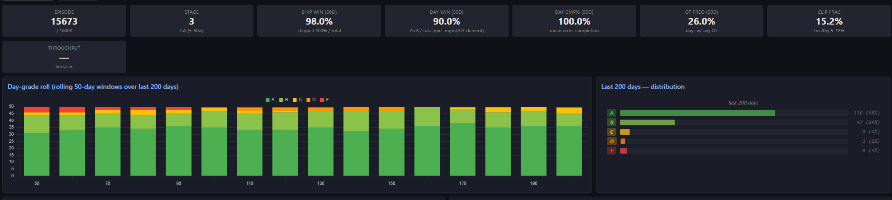

# Clark Live Training Dashboard

A single-file HTML dashboard ships with the repo. Double-click [`clark/dashboard/dashboard.bat`](../clark/dashboard/dashboard.bat) to launch the local server and open it in your browser at `http://localhost:8080/`. It reads the same `training_metrics.json` the trainer is writing — no contention, no extra overhead.

The dashboard exists because long-horizon RL training is opaque from the loss curve alone. The day-grade roll, per-N tables, and reward-component breakdown are how you actually catch what's going wrong while it's going wrong.

*Above: a live snapshot from a mid-training v2.8 fine-tune. Status tiles surface the operational headline numbers (Ship Win, Day Win, Day Cmp%, OT frequency, PPO clip health). The day-grade roll on the left tracks rolling 50-day windows of A/B/C/D/F across the last 200 days — the high-frequency signal you actually watch during training. The 200-day distribution on the right is the same data aggregated. The numbers here reflect the policy state mid-iteration; for verified post-training performance see Clark's [Performance section](../README.md#performance-and-status).*

---

## Top half — the live state

- **Status tiles** — episode / stage / day-level win, completion, OT frequency, PPO clip fraction, throughput.
- **Operational vs graded win** — `ship_win` (fraction of days that shipped 100% of orders — the primary KPI) is logged and shown alongside the grade-based `win` (A/B-day fraction). An audit found the grade conflates the primary job with secondary management/OT demerits — half of "lost" days shipped everything and were demerited only for secondary duties — so the two are surfaced separately rather than collapsed into one number.
- **Day-grade roll** — rolling 50-day windows of A/B/C/D/F across the last 200 simulated days. The high-frequency learning signal that populates within minutes of starting.
- **Reward components panel** — per-day mean magnitude of every reward signal, sorted, divergent-bar visualization. This is how you spot which penalty is dominating.
- **Pipeline trend** — `per_order_incomplete` (orders never shipped) vs `picked_backlog` (picked but not packed) vs `per_order_shipped` over the last 200 days. Direct visualization of whether the model is balancing pickers and packers correctly.
- **Per-N performance table** — eps / win% / Cmp% / OT% / R/W broken down by worker count. The single most useful diagnostic for variable-N training: lets you see at a glance "the model is competent at N=8-10 but struggling at N=15."
- **Sampler N-distribution per stage** — verifies the curriculum is actually drawing from the expected N range. Caught a real bug where every resume was silently re-sampling stage 1 only.
- **PPO health** — clip fraction / P-loss / V-loss / entropy across the last 500 updates.

---

## Bottom half — per-episode + curriculum

- **Year win-rate per episode** + **R/W per episode** — raw values plus a rolling-25 smoothed line, so noise and trend are both visible.
- **Per-N year win rate scatter** — every recent episode as one dot, makes the variable-N landscape obvious at a glance.
- **Recent episodes list** — last 25 completed episodes with grade, completion, OT, R/W.
- **Per-stage rollup** — clean stage 1 / 2 / 3 separation.
- **Curriculum stage timeline** — stepped line showing where the model has been in the curriculum over the run.

---

## Reading it during a run

Three high-signal questions to ask the dashboard, in order:

1. **"Is the policy progressing or saturating?"** — the day-grade roll is the answer. If A+B share is climbing, training is doing work. If it's flat over the last 500 updates AND clip fraction sits at 0%, the policy has hit a local optimum or a saturated value head. Check Value-loss panel; if it's spiking, see *Reward Design / Value-head stability* in [ARCHITECTURE.md](ARCHITECTURE.md).
2. **"Where is the policy weakest?"** — the per-N table tells you which roster sizes are underperforming. A 50% F-rate at N=20 with healthy A-rate at N=10 means the curriculum sampler is starving the model of high-N exposure (check N-distribution per stage).
3. **"What's the dominant reward signal?"** — the components panel sorted by magnitude. If `picked_backlog` is the largest negative for 100 episodes running, picker/packer balance isn't being learned — usually means `pick_buffer_capacity` is unset or too high in the config.

For the engineering rationale behind each metric (why `ship_win` is logged separately, why the per-N table matters more than aggregate win, etc.), see [`docs/ARCHITECTURE.md`](ARCHITECTURE.md) and [`NOTE.md`](../NOTE.md).
